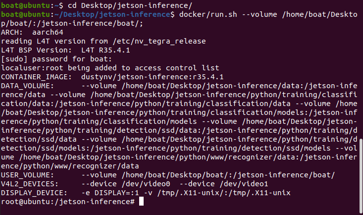

## Setup:
Open a terminal and run this commands.



```
cd Desktop/jetson-inference/
```
```
docker/run.sh --volume /home/boat/Desktop/boat/:/jetson-inference/boat/
```       
```
cd jetson-inference/boat/jetson
```   

## Detect
Detect is if you just want to see the model bounding boxes without an control operations. Good for new labeled dataset testing.

IMAGE HERE

```
python3 detect.py --model=models/v3/mb1-ssd-Epoch-28-Loss-1.924500224325392.pth --labels=models/v3/labels.txt --input-width=640 --input-height=640 --input-blob=input_0 --output-cvg=scores --output-bbox=boxes --threshold=.15 /jetson-inference/boat/tasks/run4.mp4
```

## Control
Controls is when you want the craft to run it's control operations for the compitions. Make sure to `pip3 install pyserial-3.5-py2.py3-none-any.whl`. Need to rebuild containe to fix this but that takes a hot minute. You can also run using the camera `/dev/video0`.

IMAGE HERE

```
python3 control.py --model=models/v3/mb1-ssd-Epoch-28-Loss-1.924500224325392.pth --labels=models/v3/labels.txt --input-width=640 --input-height=640 --input-blob=input_0 --output-cvg=scores --output-bbox=boxes --threshold=.15 /jetson-inference/boat/tasks/run4.mp4
```

# Videos
The goal of this page is to show users how to run the controls code using a video. This is good for dry run testing to see how the controls would work without having to be in the water. Example video is `/jetson-inference/boat/tasks/run4.mp4`.

YOUTUBE VIDEO EXAMPLE HERE

Put your video in the `tasks/` folder and run the code below.

```
python3 detect.py --model=models/v3/mb1-ssd-Epoch-28-Loss-1.924500224325392.pth --labels=models/v3/labels.txt --input-width=640 --input-height=640 --input-blob=input_0 --output-cvg=scores --output-bbox=boxes --threshold=.15 /jetson-inference/boat/tasks/run4.mp4
```