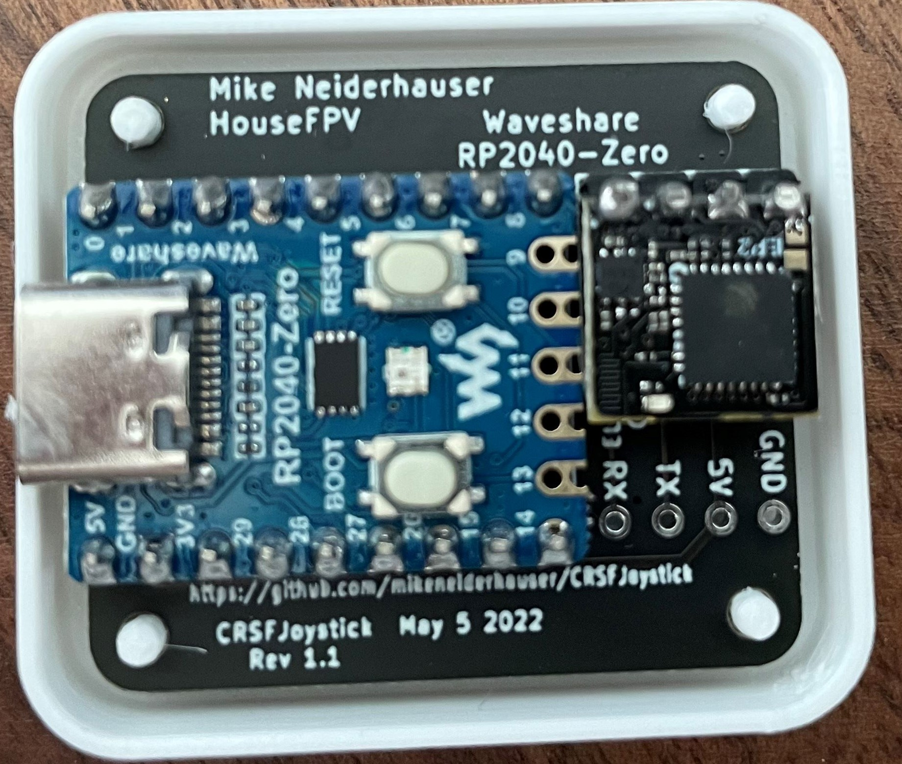
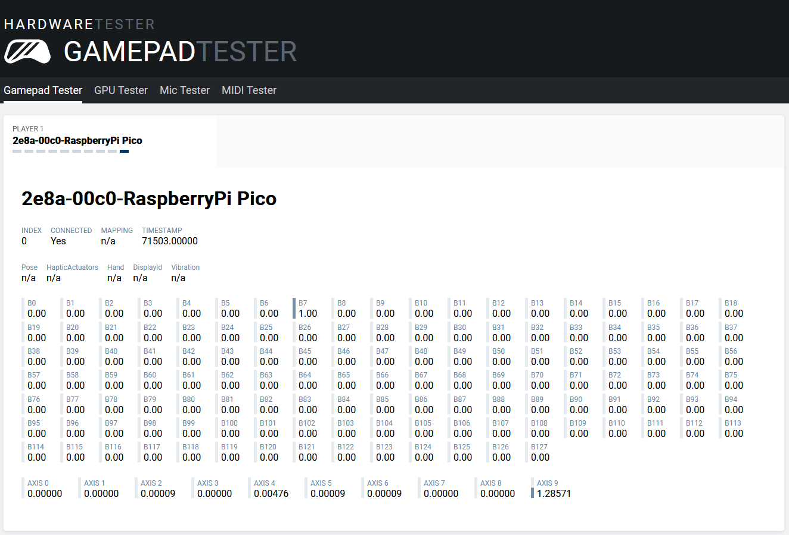

#All of the RoboBoat RC Controls code is build on top of the packages below. 

Would like to give them the credit they deserve.
-Dylan

# ELRSJoystick / CRSFJoystick

<https://github.com/mikeneiderhauser/CRSFJoystick>

Named CRSFJoystick as it indicates the wire protocol between the microcontroller (pi pico) and receiver).

Arduino code using the mbed core that runs on a Pi Pico (2040) to emulate a USB HID Joystick

Pirmarily developed to use and ExpressLRS receiver and a HID Joystick for Sim use! It will work with both Tracer and Crossfire as well.

Shout out to CapnBry for the Crsf Library

https://github.com/CapnBry/CRServoF

Shout out to RealRobots.net for the Gamepad Library

https://gitlab.com/realrobots/PicoGamepad/-/tree/master

# Demo Video

- Blank carrier boards for Pi Pico, Tiny 2040, and Waveshare RP2040 (old stock)
- Built and flashed units
- [DIY Section](#diy-hardware)

A few boards that I believe are based off of this project:
- HGLRC Dongle (I have samples from HGLRC on the way)
  - [HGLRC Dongle at HGLRC](https://www.hglrc.com/collections/new-arrivals/products/hglrc-c1-remote-control)
  - [HGLRC C1 Radio Kit with dongle at HGLRC](https://www.hglrc.com/collections/new-arrivals/products/hglrc-c1-remote-control)
  - [HGLRC C1 Radio Kit with dongle at RacedayQuads](https://www.racedayquads.com/products/hglrc-c1-transmitter-elrs-2-4ghz-choose-your-version?keyword=hglrc%20c1)
- Squid Stick (I have personally not tested one)
  -  [Squid Stick at Progressiverc.com](https://www.progressiverc.com/products/squid-stick-elrs-2-4ghz-usb-receiver-module)
  -  Squid Stick at RacedayQuads - Link to be posted when available
- YMZFPV Simulator Adapter (have not yet been able to confirm that this is based off of this project)
  - [YMZFPV Sim Adapter at RacedayQuads](https://www.racedayquads.com/products/ymzfpv-wireless-simulator-adapter-for-sbus-pwm-csfr-choose-your-version?keyword=simulator)

## Compatability

This project was designed primarily with ELRS usage in mind, however this code base has also been tested with TBS Crossfire Receivers (915MHZ) (last tested v6.16) and TBS Tracer Receivers (2.4GHz) (last tested v6.17) and both appear to work! Flight was teseted in the Liftoff simulator.

I no longer have TBS Crossfire nor TBS Tracer TX modules or Receivers so future tests will have to be conducted by others.

### ExpressLRS (Waveshare RP2040)

### Crossfire

### Tracer

# Building / Flashing

I recently converted the projet to PlatformIO to aid in building, board management, etc.  PlatformIO has some known quirks with PiPico boards and I'm going to leave some breadcrumbs here for later.

## VSCode with PlatformIO

### Installing VSCode and PlatformIO
<https://platformio.org/install/ide?install=vscode>

### Build for specific board / environment

At the Bottom of VSCode you will see a tool bar.  Look for `Default (CRSFJoystick)`.  Building in this state will build for all boards / environments defined in the `platformio.ini` file.  To target a sepecific board, Click on `Default (CRSFJoystick)` and select an appropriate option (Note, selection pops up at the top of vscode).

Click on the Checkmark on the bottom toolbar to build for the board / environment you selected.

Click on the `->` on the bottom toolbar to upload to the board.  If upload fails to find your board, please see bothe the [alternative upload](#alternative-upload) section as well as the driver section.

## Alternative upload
This is one of the standard advertised methods for uploading firmware to a pipico based microcontroller board.

Press and hold the bootsel button on your board and either plugin/power on the board or if the board is already powered press and release the reset button.

This will put the board in RP2 Boot mode.

A removable device should pop up or become available on your computer.  Drag and drop the `firmware.u2f` file from the `.pio/build/wavesharerp2040zero/` directory into this device on your computer.  Note replpace wavesharerp2040zero with the environment for your board.

## Drivers
Drivers can be hit or miss for the pipico board and platformio.  

You may need to use zadig to get vscode+platforio to be able to upload directly to the board.
<https://github.com/platformio/platform-raspberrypi/issues/2#issuecomment-828586398>

Below are the drivers I have working on my Windows 11 machine.  You may need to modify the driver selection via zadig and or device manager to get it working.

- Standard Running Mode
  - RaspberryPi Pico (Interface 0)
    - Zadig -> HidUsb v10.0.22621.819
    - Device Manager -> Human Interface Devices -> HID-compliant game controller
  - RaspberryPi Pico (Interface 1)
      - Zadig -> usbser v10.0.22621.1778
      - Device Manager -> Ports (COM & LPT) -> USB Serial Device
- RP2 Boot mode
  - RP2 Boot (Interface 0) 
    - Zadig USBSTOR v10.0.022621.1778 
    - Device Manager -> Disk Drives -> RPI RP2 USB Device 
  - RP2 Boot (Interface 1)
    - Zadig WinUSB v6.1.7600.16385
    Device Manager -> Universal Serial Bus Devices -> RP2 Boot

### Device manager clicks to change driver 
Right Click -> Properties -> Update Driver -> Browse my computer for drivers -> Let me pick from a list of available drivers on my computer

# Flashing ELRS Receiver

Depending on the device you are using, your target may be different.  For all of the DIY version's I've made, I used the HappyModel EP2 Rx.  Other vendors may vary.

## Flashing via Betaflight Passthrough
<https://www.expresslrs.org/software/updating/betaflight-passthrough/>

## Flashing via Wifi
If your receiver is wifi enabled you can also flash it via wifi

<https://www.expresslrs.org/software/updating/wifi-updating/>

# Testing
For a quick test of functionality, I typically go to [GamepadTester](https://hardwaretester.com/gamepad).

Once the Radio is bound to the RX, it should show up in GamePadTester.

# Mappings
This was a quick map and is not fully featured.

On link up/down the onboard Pi Pico LED will light indicating connection

*NOTE* Channel 5, 6, 7, and 8 are mapped both to analog axis as well as joystick buttons.

| Channel     | Logical Mapping  | Joystick Mapping |
| ----------- | ---------------- | ---------------- |
| 1           | A                | X                |
| 2           | E                | Y                |
| 3           | T                | Rx               |
| 4           | R                | Ry               |
| 5           | Channel 5 (Full) AND AUX1 (1510-2011) | Z  AND Button 0 |
| 6           | Channel 6 (Full) AND AUX2 (1510-2011) | Rz AND Button 1 |
| 7           | Channel 7 (Full) AND AUX3 (1510-2011) | S0 AND Button 2 |
| 8           | Channel 8 (Full) AND AUX4 (1510-2001) | S1 AND Button 3 |
| 9           | AUX5 (1510-2011) | Button 4         |
| 10          | AUX6 (1510-2011) | Button 5         |
| 11          | AUX7 (1510-2011) | Button 6         |
| 12          | AUX8 (1510-2011) | Button 7         |
| 13          | Not Used         | Not Used         |
| 14          | Not Used         | Not Used         |
| 15          | LQ - Not Used    | Not Used         |
| 16          | RSSI - Not Used  | Not Used         |

*Note additional button mappings can be created in caliration.h*

# Here below is for DIY Builds and may be slightly outdated
# DIY Hardware

In a nutshell, wire the ELRS RX up to a uart on the pipico, 5v, and gnd.

| Raspberry Pico | ELRS/CRSF Receiver |
| -------------- | ------------------ |
| VBUS (PIN 40)  | 5V                 |
| GND  (PIN 38)  | GND
| GP4  (PIN 6)   | RX                 |
| GP5  (PIN 7)   | TX                 |

Other boards are supported, see the [board_defs.h](./include/board_defs.h) file.
